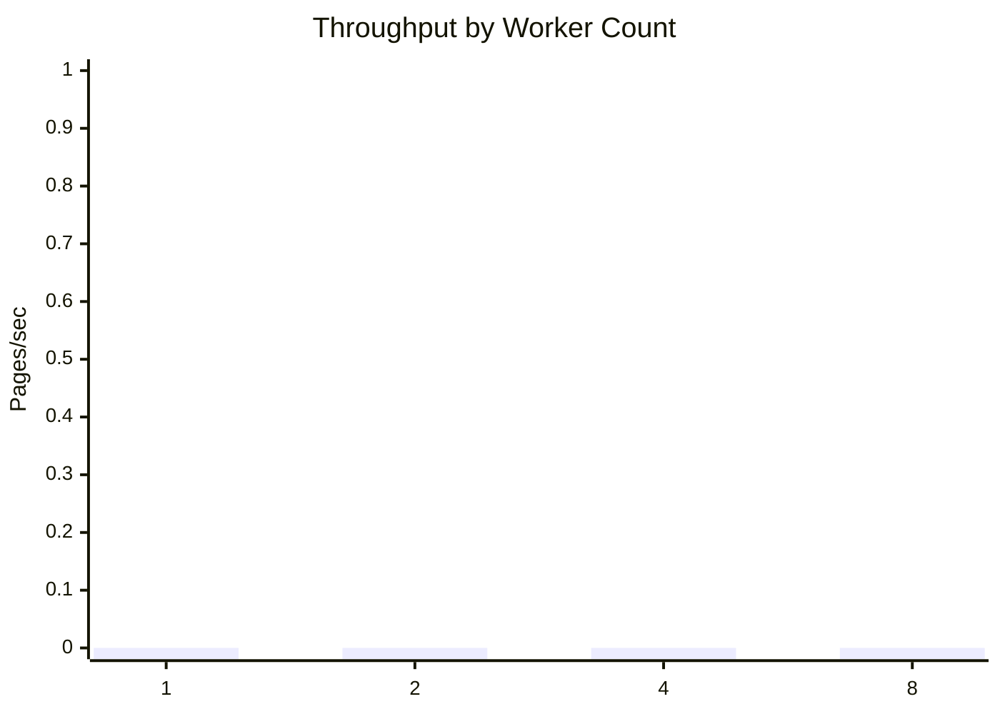
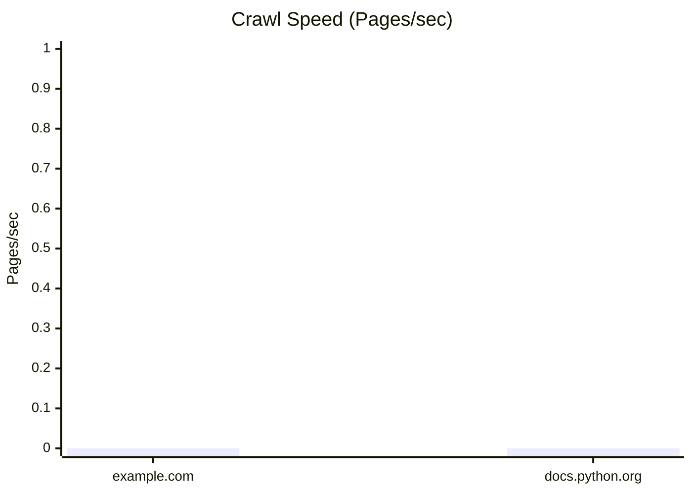

# WebWeaveX Benchmarks Report

This report summarizes performance benchmarks produced by the scripts in `benchmarks/`.
Run the benchmark scripts to populate `benchmarks/results/*.json`, then update this
report with the latest metrics.

## Crawl Speed

| Target | Pages Crawled | Crawl Time (s) | Pages/sec | Notes |
| --- | --- | --- | --- | --- |
| https://example.com | N/A | N/A | N/A | Run `python benchmarks/crawl_speed.py` |
| https://docs.python.org | N/A | N/A | N/A | Run `python benchmarks/crawl_speed.py` |

## Distributed Scaling

| Workers | Jobs | Duration (s) | Throughput (pages/sec) | Avg Queue Latency (s) | P95 Queue Latency (s) | Notes |
| --- | --- | --- | --- | --- | --- | --- |
| 1 | N/A | N/A | N/A | N/A | N/A | Run `python benchmarks/distributed_scaling.py` |
| 2 | N/A | N/A | N/A | N/A | N/A | Run `python benchmarks/distributed_scaling.py` |
| 4 | N/A | N/A | N/A | N/A | N/A | Run `python benchmarks/distributed_scaling.py` |
| 8 | N/A | N/A | N/A | N/A | N/A | Run `python benchmarks/distributed_scaling.py` |

## JS Rendering Performance

| Target | Non-Rendered (s) | Rendered (s) | Slowdown | Notes |
| --- | --- | --- | --- | --- |
| https://example.com | N/A | N/A | N/A | Run `python benchmarks/js_rendering.py` |
| https://docs.python.org | N/A | N/A | N/A | Run `python benchmarks/js_rendering.py` |

## Graphs

## Analysis

- Crawl throughput varies based on network conditions, target site complexity, and
  concurrency settings.
- Distributed scaling should improve throughput up to a saturation point determined
  by bandwidth and crawl politeness limits.
- JS rendering is expected to be slower than non-rendered fetches due to browser
  startup and DOM evaluation overhead.
